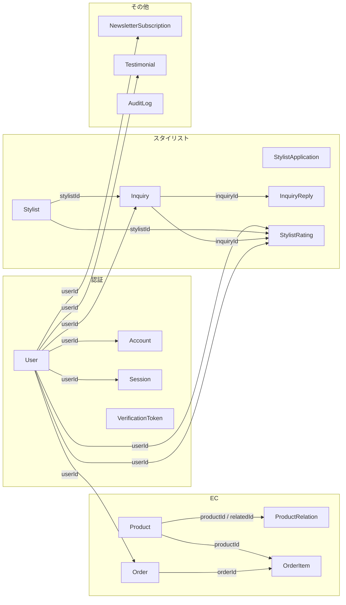
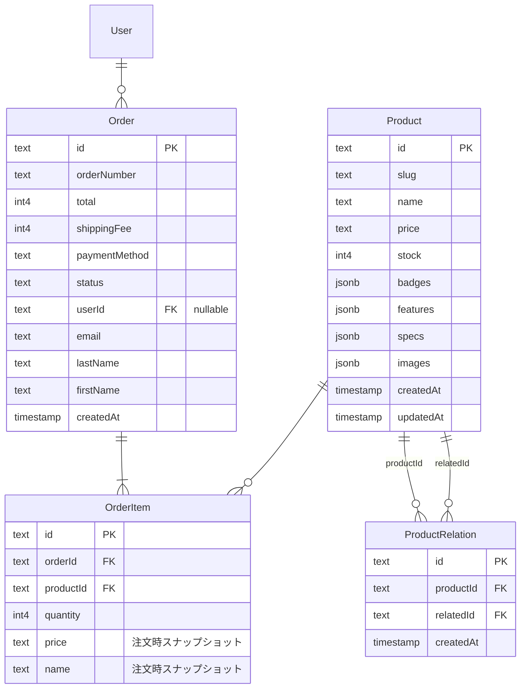
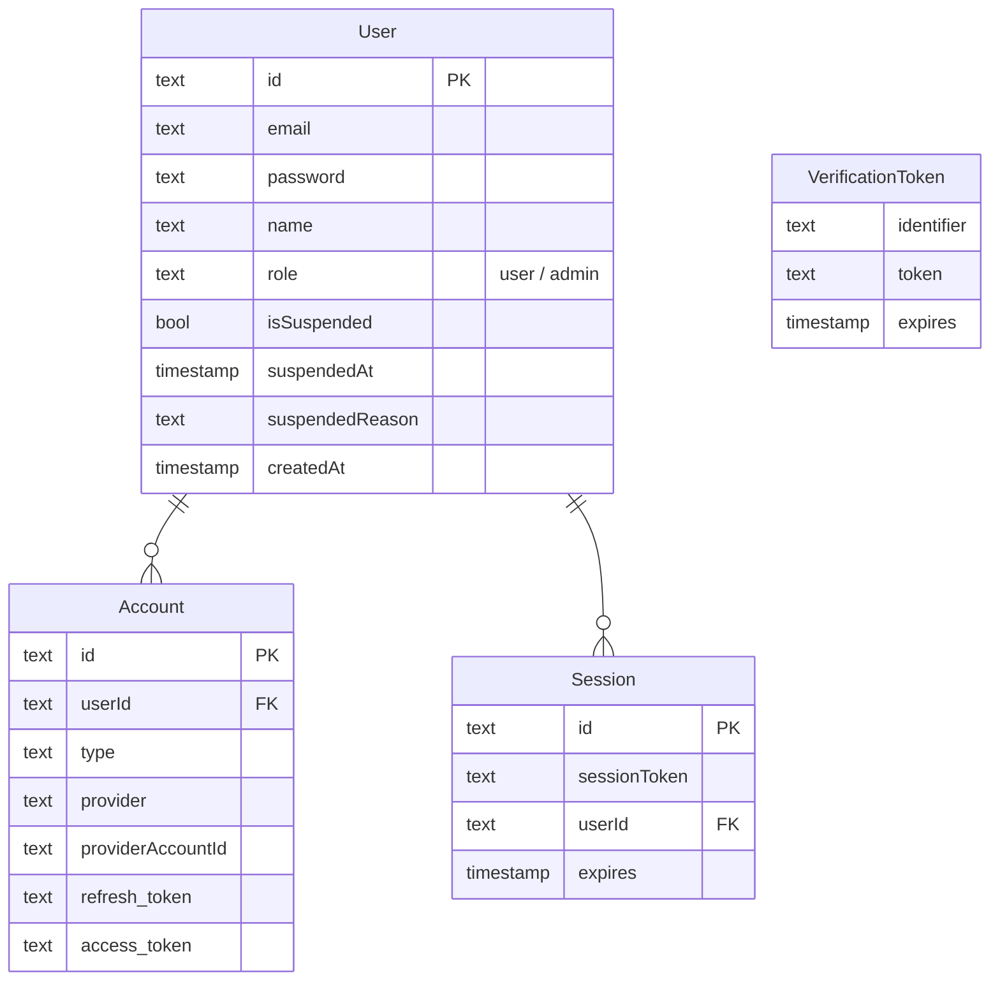
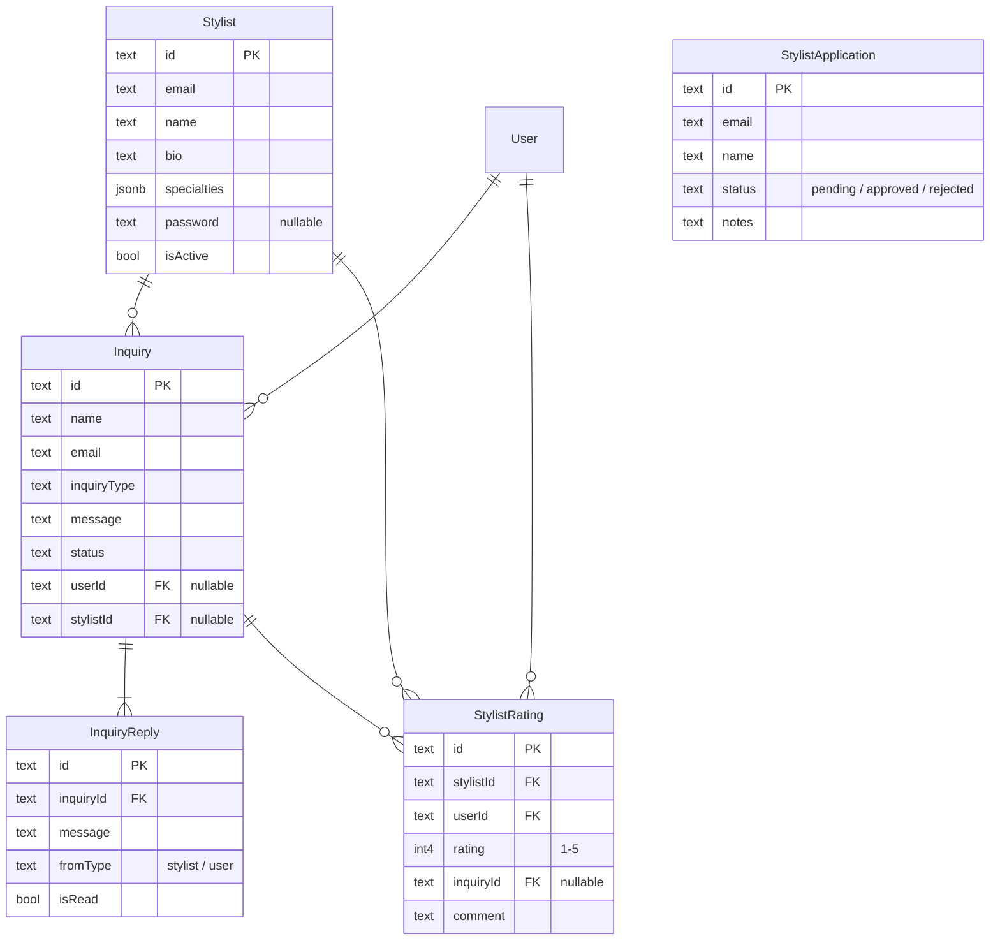
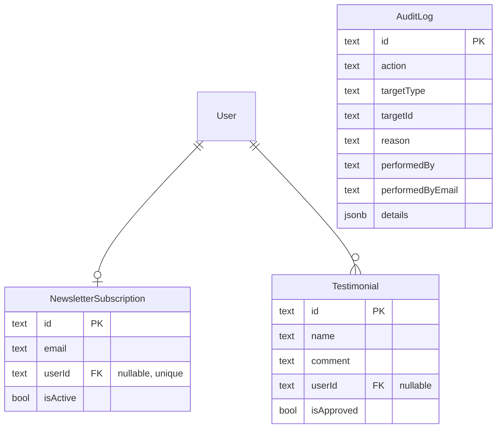

# Intercambio DB設計図

**データソース:** Supabase（PostgreSQL）実スキーマ  
**ORM:** Prisma  
**アプリ用テーブル:** 15 / **システム用:** 1（`_prisma_migrations`）

---

## 全体 ER 図（リレーション）

ポートフォリオ用のメイン図。`_prisma_migrations` は Prisma 管理用のため除外。

```mermaid
erDiagram
    User ||--o{ Order : "1:N"
    User ||--o{ Inquiry : "1:N"
    User ||--o| NewsletterSubscription : "1:0..1"
    User ||--o{ Testimonial : "1:N"
    User ||--o{ StylistRating : "1:N"
    User ||--o{ Account : "1:N"
    User ||--o{ Session : "1:N"

    Product ||--o{ OrderItem : "1:N"
    Product ||--o{ ProductRelation : "productId"
    Product ||--o{ ProductRelation : "relatedId"

    Order ||--|{ OrderItem : "1:N"

    Stylist ||--o{ Inquiry : "1:N"
    Stylist ||--o{ StylistRating : "1:N"

    Inquiry ||--|{ InquiryReply : "1:N"
    Inquiry ||--o{ StylistRating : "1:N"

    User {
        text id PK
        text email UK
        text password
        text role
        bool isSuspended
    }

    Product {
        text id PK
        text slug UK
        text name
        int4 stock
        jsonb badges
    }

    Order {
        text id PK
        text orderNumber UK
        int4 total
        text status
        text userId FK
    }

    OrderItem {
        text id PK
        text orderId FK
        text productId FK
        int4 quantity
    }

    Stylist {
        text id PK
        text email UK
        text name
        bool isActive
    }

    Inquiry {
        text id PK
        text inquiryType
        text status
        text userId FK
        text stylistId FK
    }

    InquiryReply {
        text id PK
        text inquiryId FK
        text fromType
        bool isRead
    }

    StylistRating {
        text id PK
        text stylistId FK
        text userId FK
        text inquiryId FK
        int4 rating
    }

    NewsletterSubscription {
        text id PK
        text email UK
        text userId FK_UK
        bool isActive
    }

    Testimonial {
        text id PK
        text name
        text comment
        bool isApproved
        text userId FK
    }

    AuditLog {
        text id PK
        text action
        text targetType
        text performedBy
    }

    Account {
        text id PK
        text userId FK
        text provider
    }

    Session {
        text id PK
        text userId FK
        text sessionToken UK
    }

    StylistApplication {
        text id PK
        text email
        text status
    }

    VerificationToken {
        text identifier
        text token UK
        timestamp expires
    }

    ProductRelation {
        text id PK
        text productId FK
        text relatedId FK
    }
```

---

## 外部キー関係図



---

## ドメイン別 ER 図

### 1. EC（商品・注文）



### 2. 認証・ユーザー



### 3. スタイリスト・相談



### 4. その他



---

## テーブル定義（Supabase 実スキーマ）

### `_prisma_migrations`（システム・図から除外可）

| カラム | 型 | 制約 |
|--------|-----|------|
| id | varchar | PK |
| checksum | varchar | |
| finished_at | timestamptz | nullable |
| migration_name | varchar | |
| logs | text | nullable |
| rolled_back_at | timestamptz | nullable |
| started_at | timestamptz | |
| applied_steps_count | int4 | |

### `Product`

| カラム | 型 | 制約 |
|--------|-----|------|
| id | text | PK |
| slug | text | unique |
| name | text | |
| price | text | |
| tagline | text | |
| description | text | |
| image | text | |
| stock | int4 | |
| badges | jsonb | |
| features | jsonb | |
| specs | jsonb | |
| shipping | text | |
| care | text | |
| images | jsonb | |
| createdAt | timestamp | |
| updatedAt | timestamp | |

### `ProductRelation`

| カラム | 型 | 制約 |
|--------|-----|------|
| id | text | PK |
| productId | text | FK → Product |
| relatedId | text | FK → Product |
| createdAt | timestamp | |

### `Order`

| カラム | 型 | 制約 |
|--------|-----|------|
| id | text | PK |
| orderNumber | text | unique |
| total | int4 | |
| shippingFee | int4 | |
| paymentMethod | text | |
| status | text | |
| userId | text | FK → User, nullable |
| lastName | text | |
| firstName | text | |
| lastNameKana | text | |
| firstNameKana | text | |
| postalCode | text | |
| prefecture | text | |
| city | text | |
| address | text | |
| building | text | nullable |
| phone | text | |
| email | text | |
| notes | text | nullable |
| cardLast4 | text | nullable |
| cardExpiryMonth | text | nullable |
| cardExpiryYear | text | nullable |
| createdAt | timestamp | |
| updatedAt | timestamp | |

### `OrderItem`

| カラム | 型 | 制約 |
|--------|-----|------|
| id | text | PK |
| orderId | text | FK → Order |
| productId | text | FK → Product |
| quantity | int4 | |
| price | text | 注文時点の価格 |
| name | text | 注文時点の商品名 |

### `User`

| カラム | 型 | 制約 |
|--------|-----|------|
| id | text | PK |
| email | text | unique |
| emailVerified | timestamp | nullable |
| password | text | |
| name | text | |
| lastName | text | nullable |
| firstName | text | nullable |
| phone | text | nullable |
| role | text | user / admin |
| image | text | nullable |
| isSuspended | bool | |
| suspendedAt | timestamp | nullable |
| suspendedReason | text | nullable |
| createdAt | timestamp | |
| updatedAt | timestamp | |

### `Stylist`

| カラム | 型 | 制約 |
|--------|-----|------|
| id | text | PK |
| name | text | |
| nameEn | text | nullable |
| bio | text | |
| specialties | jsonb | |
| image | text | nullable |
| email | text | unique |
| password | text | nullable |
| isActive | bool | |
| createdAt | timestamp | |
| updatedAt | timestamp | |

### `StylistApplication`

| カラム | 型 | 制約 |
|--------|-----|------|
| id | text | PK |
| name | text | |
| nameEn | text | nullable |
| bio | text | |
| specialties | jsonb | |
| image | text | nullable |
| email | text | |
| password | text | nullable |
| status | text | pending / approved / rejected |
| notes | text | nullable |
| createdAt | timestamp | |
| updatedAt | timestamp | |

### `Inquiry`

| カラム | 型 | 制約 |
|--------|-----|------|
| id | text | PK |
| name | text | |
| email | text | |
| inquiryType | text | styling / product / order / other |
| message | text | |
| status | text | new / in_progress / resolved |
| userId | text | FK → User, nullable |
| stylistId | text | FK → Stylist, nullable |
| createdAt | timestamp | |
| updatedAt | timestamp | |

### `InquiryReply`

| カラム | 型 | 制約 |
|--------|-----|------|
| id | text | PK |
| inquiryId | text | FK → Inquiry |
| message | text | |
| fromType | text | stylist / user |
| fromEmail | text | nullable |
| fromName | text | nullable |
| isRead | bool | |
| createdAt | timestamp | |
| updatedAt | timestamp | |

### `StylistRating`

| カラム | 型 | 制約 |
|--------|-----|------|
| id | text | PK |
| stylistId | text | FK → Stylist |
| userId | text | FK → User |
| rating | int4 | 1〜5 |
| comment | text | nullable |
| inquiryId | text | FK → Inquiry, nullable |
| createdAt | timestamp | |
| updatedAt | timestamp | |

**一意制約:** `(userId, inquiryId)` — 同一相談への重複評価を防止

### `Account` / `Session` / `VerificationToken`（NextAuth.js）

| テーブル | 主なカラム | 備考 |
|---------|-----------|------|
| Account | userId FK, provider, providerAccountId | OAuth 連携用 |
| Session | userId FK, sessionToken, expires | セッション管理 |
| VerificationToken | identifier, token, expires | メール認証用 |

### `NewsletterSubscription`

| カラム | 型 | 制約 |
|--------|-----|------|
| id | text | PK |
| email | text | unique |
| userId | text | FK → User, nullable, unique |
| isActive | bool | |
| createdAt | timestamp | |
| updatedAt | timestamp | |

### `Testimonial`

| カラム | 型 | 制約 |
|--------|-----|------|
| id | text | PK |
| name | text | |
| role | text | nullable |
| comment | text | |
| userId | text | FK → User, nullable |
| email | text | nullable |
| isApproved | bool | |
| createdAt | timestamp | |
| updatedAt | timestamp | |

### `AuditLog`

| カラム | 型 | 制約 |
|--------|-----|------|
| id | text | PK |
| action | text | delete / suspend / activate / update |
| targetType | text | user / order / product 等 |
| targetId | text | |
| targetEmail | text | nullable |
| reason | text | |
| details | jsonb | nullable |
| performedBy | text | 管理者 User ID |
| performedByEmail | text | |
| ipAddress | text | nullable |
| userAgent | text | nullable |
| createdAt | timestamp | |

---

## テーブル一覧（アプリ用 15）

| # | テーブル | ドメイン | 説明 |
|---|---------|---------|------|
| 1 | User | 認証 | 一般ユーザー・管理者 |
| 2 | Account | 認証 | NextAuth OAuth |
| 3 | Session | 認証 | NextAuth セッション |
| 4 | VerificationToken | 認証 | メール認証トークン |
| 5 | Product | EC | 商品マスタ |
| 6 | ProductRelation | EC | 関連商品（自己参照多対多） |
| 7 | Order | EC | 注文ヘッダ |
| 8 | OrderItem | EC | 注文明細 |
| 9 | Stylist | スタイリスト | スタイリストアカウント |
| 10 | StylistApplication | スタイリスト | 登録申請 |
| 11 | Inquiry | 相談 | お問い合わせ・相談 |
| 12 | InquiryReply | 相談 | 返信スレッド |
| 13 | StylistRating | 相談 | スタイリスト評価 |
| 14 | NewsletterSubscription | その他 | メルマガ購読 |
| 15 | Testimonial | その他 | お客様の声 |
| 16 | AuditLog | その他 | 管理者操作ログ |

---

## 設計上のポイント

1. **ユーザー種別** — `User.role`（user/admin）と `Stylist` テーブルを分離
2. **注文スナップショット** — `OrderItem.price` / `name` で注文時点の値を保持
3. **関連商品** — `ProductRelation` で Product 同士の多対多（自己参照）
4. **相談スレッド** — `Inquiry` → `InquiryReply`（1:N）
5. **評価の一意制約** — `StylistRating(userId, inquiryId)` で重複防止
6. **監査ログ** — FK なし。`performedBy` に管理者 ID を文字列で記録

---

## 画像化の手順（Canva 用）

| スライド | 使う図 |
|---------|--------|
| 1 | 全体 ER 図 |
| 2 | EC ドメイン |
| 3 | 認証ドメイン |
| 4 | スタイリスト・相談ドメイン |
| 5 | テーブル一覧 + 設計ポイント |

1. [Mermaid Live Editor](https://mermaid.live/) を開く
2. 上記コードを貼り付け
3. **Actions → PNG / SVG** でエクスポート
4. Canva に配置
