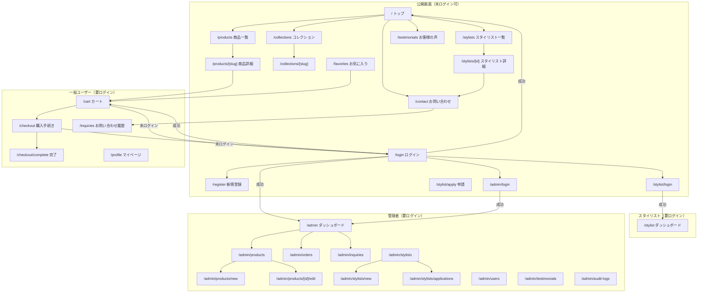
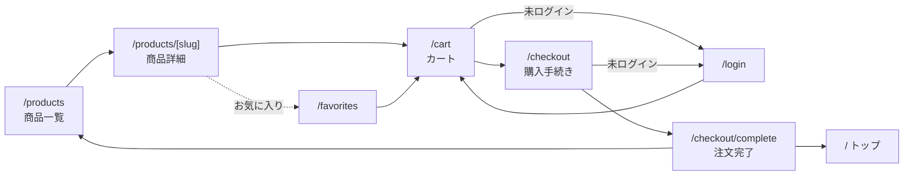
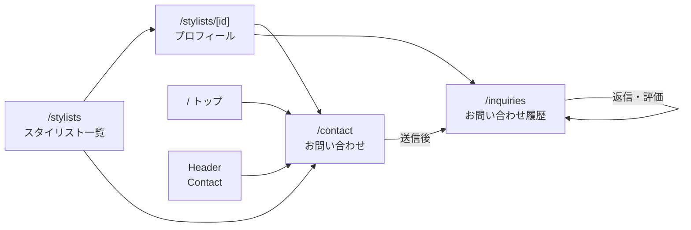
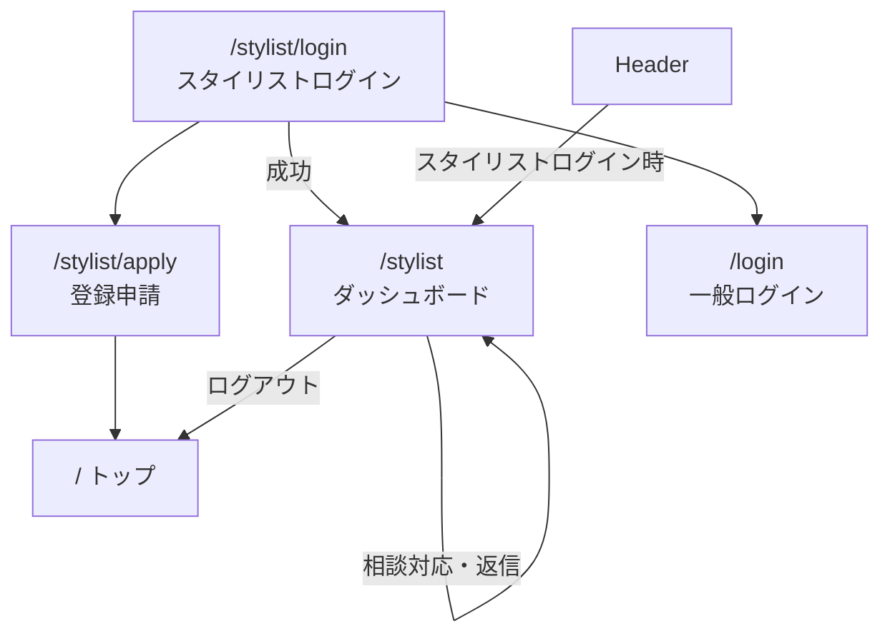
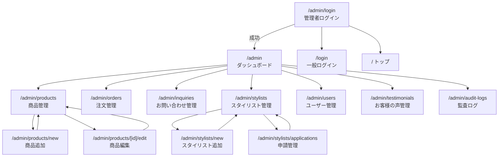
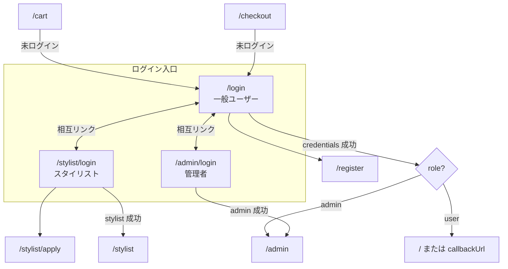
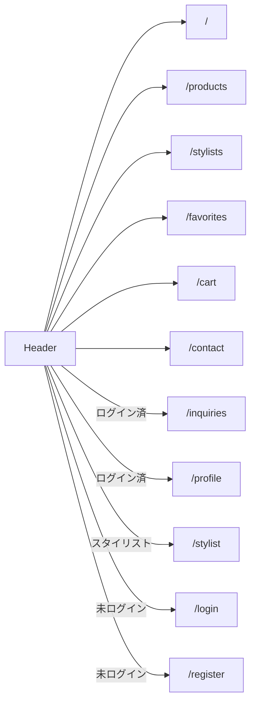

# Intercambio 画面遷移図

**全画面数:** 33（404含む）  
**ロール:** 一般ユーザー / スタイリスト / 管理者

---

## 全体構成（ロール別）



---

## 一般ユーザー：購入フロー



**認証:** `/cart` `/checkout` は Middleware で保護（未ログイン → `/login`）

---

## 一般ユーザー：相談・お問い合わせフロー



---

## スタイリストフロー



**認証:** `/stylist` は Middleware で保護（未ログイン or 非stylist → `/stylist/login`）

---

## 管理者フロー



**認証:** `/admin/*`（`/admin/login` 除く）は Middleware で保護（非admin → `/` または `/login`）

---

## 認証・ログイン導線



---

## グローバルナビゲーション（Header）

一般画面・スタイリスト／管理者画面以外で表示。



---

## 画面一覧

### 公開画面

| パス | 画面名 | 備考 |
|------|--------|------|
| `/` | トップ | 注目商品・コレクション・お客様の声 |
| `/products` | 商品一覧 | |
| `/products/[slug]` | 商品詳細 | カート追加 |
| `/collections` | コレクション一覧 | |
| `/collections/[slug]` | コレクション詳細 | |
| `/stylists` | スタイリスト一覧 | |
| `/stylists/[id]` | スタイリスト詳細 | 相談へ誘導 |
| `/testimonials` | お客様の声 | |
| `/contact` | お問い合わせ | スタイリスト指定可 |
| `/favorites` | お気に入り | localStorage ベース |
| `/login` | ログイン | 一般ユーザー |
| `/register` | 新規登録 | |
| `/stylist/login` | スタイリストログイン | |
| `/stylist/apply` | スタイリスト申請 | |
| `/admin/login` | 管理者ログイン | |

### 一般ユーザー（要ログイン）

| パス | 画面名 | 保護 |
|------|--------|------|
| `/cart` | カート | Middleware |
| `/checkout` | 購入手続き | Middleware |
| `/checkout/complete` | 注文完了 | 購入後遷移 |
| `/inquiries` | お問い合わせ履歴 | セッション利用 |
| `/profile` | マイページ | Server redirect |

### スタイリスト（要ログイン）

| パス | 画面名 | 保護 |
|------|--------|------|
| `/stylist` | ダッシュボード | Middleware（role=stylist） |

### 管理者（要ログイン）

| パス | 画面名 | 保護 |
|------|--------|------|
| `/admin` | ダッシュボード | Middleware（role=admin） |
| `/admin/products` | 商品管理 | 同上 |
| `/admin/products/new` | 商品追加 | 同上 |
| `/admin/products/[id]/edit` | 商品編集 | 同上 |
| `/admin/orders` | 注文管理 | 同上 |
| `/admin/inquiries` | お問い合わせ管理 | 同上 |
| `/admin/stylists` | スタイリスト管理 | 同上 |
| `/admin/stylists/new` | スタイリスト追加 | 同上 |
| `/admin/stylists/applications` | 申請管理 | 同上 |
| `/admin/users` | ユーザー管理 | 同上 |
| `/admin/testimonials` | お客様の声管理 | 同上 |
| `/admin/audit-logs` | 監査ログ | 同上 |

### その他

| パス | 画面名 |
|------|--------|
| `not-found` | 404ページ → `/` `/products` へ誘導 |

---

## Middleware 保護ルート

```
/admin/:path*     → admin ロール必須（/admin/login は除外）
/cart             → ログイン必須
/checkout         → ログイン必須
/stylist          → stylist ロール必須
/stylist/:path*   → /stylist/login, /stylist/apply は除外
```

---

## 画像化の手順（Canva 用）

| スライド | 使う図 |
|---------|--------|
| 1 | 全体構成（ロール別） |
| 2 | 購入フロー |
| 3 | 相談フロー |
| 4 | 管理者フロー |
| 5 | 画面一覧表 |

1. [Mermaid Live Editor](https://mermaid.live/) を開く
2. 上記コードを貼り付け
3. **Actions → PNG / SVG** でエクスポート
4. Canva に配置
